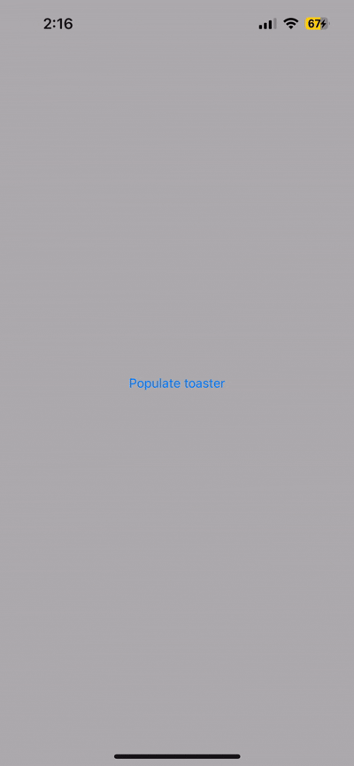

# WarmToast 🍞

A lightweight toast notification system for SwiftUI applications.

[](https://swift.org)
[](https://developer.apple.com/swift/)
[](https://swift.org/package-manager/)

WarmToast makes it incredibly easy to add beautiful, customizable toast notifications to your SwiftUI project. With support for multiple presentation styles, accent colors, and automatic toast queuing, you can enhance your app's user experience with minimal code.



## Features

- 🎨 **Customizable Styling** - Accent colors, backgrounds, animations, and more
- 🔄 **Multiple Presentation Styles** - Slide, fade, or scale
- 📚 **Toast Queuing** - Automatically present a series of toasts one after another
- 👆 **Interactive** - Users can swipe to dismiss toasts, and the countdown pauses while a toast is touched
- ⏱️ **Flexible Durations** - From quick notifications to indefinite presentation
- 🪟 **Always On Top** - Toasts appear above sheets and alerts, and touches around them reach your app
- ♿️ **Reduce Motion** - Toasts fade in instead of sliding when Reduce Motion is on
- 🎯 **SwiftUI Native** - Built specifically for SwiftUI

## Requirements

- iOS 13.0+
- Swift 6.0+
- Xcode 16.0+

## Installation

### Swift Package Manager

Add WarmToast to your project through Swift Package Manager:

1. In Xcode, select **File** > **Add Packages...**
2. Enter the package repository URL: `https://github.com/mazjap/WarmToast.git`
3. Select the version you want to use

Alternatively, add it to your `Package.swift` file:

```swift
dependencies: [
    .package(url: "https://github.com/mazjap/WarmToast.git", from: <The latest version>)
]
```

## Usage

### Basic Toast

Show a simple toast notification:

```swift
struct ContentView: View {
    @State private var showToast: Bool = false
    
    var body: some View {
        VStack {
            Button("Show Toast") {
                showToast = true
            }
        }
        .preheatToaster(
            isToasting: $showToast,
            options: .toasterStrudel(type: .info, duration: .seconds(3))
        ) {
            Text("This is a toast notification!")
        }
    }
}
```

### Toast with Custom Content

```swift
@State private var message: String? = nil

var body: some View {
    VStack {
        Button("Show Toast") {
            message = "Hello World!"
        }
    }
    .preheatToaster(
        withBread: $message,
        options: .toasterStrudel(type: .info, duration: .seconds(5))
    ) { message in
        Text(message)
            .font(.headline)
    }
}
```

### Toast Queue (Loaf)

Present multiple toasts one after another:

Each item in the loaf must be `Identifiable`:

```swift
struct Message: Identifiable {
    let id = UUID()
    let text: String
}

@State private var messages: [Message] = []

var body: some View {
    VStack {
        Button("Show Toasts") {
            messages = [
                Message(text: "First notification"),
                Message(text: "Second notification"),
                Message(text: "Third notification")
            ]
        }
    }
    .preheatToaster(
        withLoaf: $messages,
        options: .toasterStrudel(type: .info, duration: .seconds(2)),
        durationBetweenToasts: 0.5
    ) { message in
        Text(message.text)
    }
}
```

### Custom Styling

Create your own toast style:

```swift
.preheatToaster(
    withBread: $message,
    options: ToasterSettings(
        timeTilToasted: .seconds(3),
        accentColor: Color.purple,
        background: Color.black.opacity(0.8),
        presentationStyle: .scale,
        animation: .spring(),
        isSwipable: true
    )
) { message in
    Text(message)
        .foregroundColor(.white)
        .padding(.horizontal)
}
```

## Preset Toast Types

WarmToast comes with three preset toast types that you can use out of the box:

```swift
// Info toast (blue accent)
.toasterStrudel(type: .info)

// Warning toast (yellow accent)
.toasterStrudel(type: .warning)

// Error toast (red accent)
.toasterStrudel(type: .error)
```

## Advanced Usage

### Custom Toast Duration

```swift
// 5-second duration
.toasterStrudel(type: .info, duration: .seconds(5))

// Indefinite duration (stays until dismissed)
.toasterStrudel(type: .warning, duration: .indefinitely)
```

The countdown pauses while the user touches or drags the toast, and picks up where it left off when they let go.

### Presentation

Toasts are shown in their own window above the rest of your app, including sheets and alerts, in the window scene of the view you attach the toaster to. Touches on the toast go to the toast, and touches anywhere else go to your app.

If that scene isn't active yet (for example, a toast set while the app is in the background), the toast waits and appears once the scene becomes active.

## Examples

Check out the project's preview providers for more examples of how to use WarmToast:

- `Toaster_Previews`: For basic toast usage
- `AutomatedLoafToaster_Previews`: For working with toast queues

## License

WarmToast is available under the MIT license. See the [LICENSE](LICENSE) file for more info.

---

Made with ❤️ and SwiftUI. Inspired by [SimpleToast](https://github.com/sanzaru/SimpleToast)
